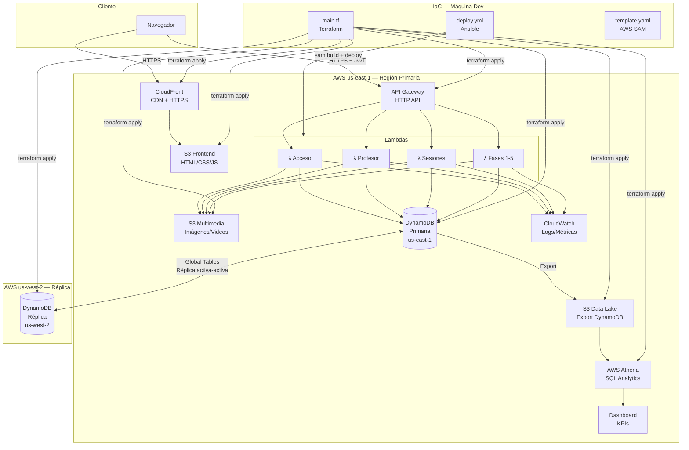

# Diagrama de Despliegue — Misión Emprende UDD

---

> Versiones adicionales del diagrama disponibles en la carpeta `Documentation/`:
> - `diagrama-despliegue.png` — imagen lista para insertar en PowerPoint
> - `diagrama-despliegue.svg` — versión vectorial escalable
> - `diagrama-despliegue.html` — versión interactiva para abrir en navegador
